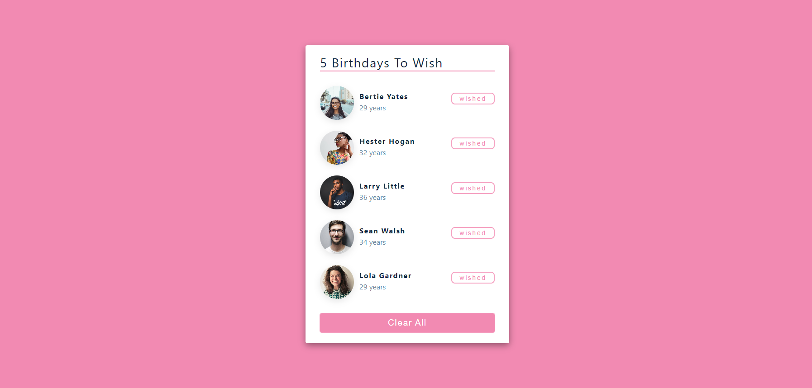

<h1 align="center">
  Birthday Reminder
</h1>

<p align="center">
  
</p>

<p align="center">
  A simple and elegant Birthday Reminder application built using HTML, CSS, and JavaScript. Powered by React.
</p>

<p align="center">
  <a href="https://birthday-stack.netlify.app/">View Live Demo</a>
</p>

---

## Overview

The Birthday Reminder is a web application that helps you keep track of upcoming birthdays. It provides a clean and intuitive interface to manage and display a list of birthdays, ensuring that you never forget to wish your loved ones.

The project is built using modern web technologies such as HTML, CSS, and JavaScript. It leverages the power of React to create a dynamic and interactive user interface. The application's responsive design ensures a seamless experience across different devices.

## Features

- Displays birthdays with the person's name, photo and age
- Remove wished birthdays
- User experience centered design
- Responsive design for optimal viewing on different devices

## Usage

1. Clone the repository:

   ```bash
   git clone https://github.com/Meenakshi-Sivakumar/birthday-reminder.git
